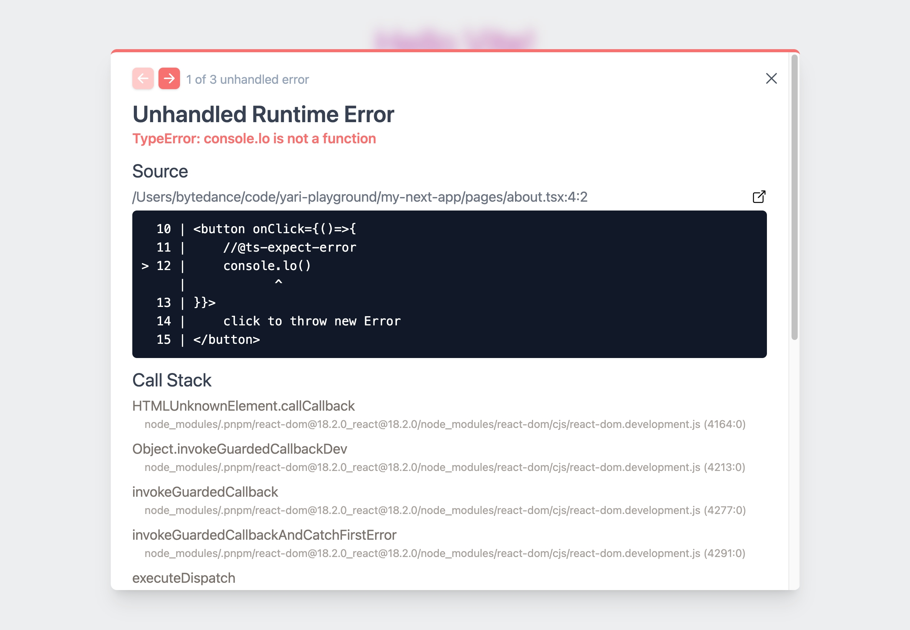

# Modern Error Overlay

Add a beautiful, modern error overlay to your dev library.



## Example

Import the library and use `addError` to add Error.

```js
import * as MEO from 'modern-error-overlay'

MEO.addError({...});
```
